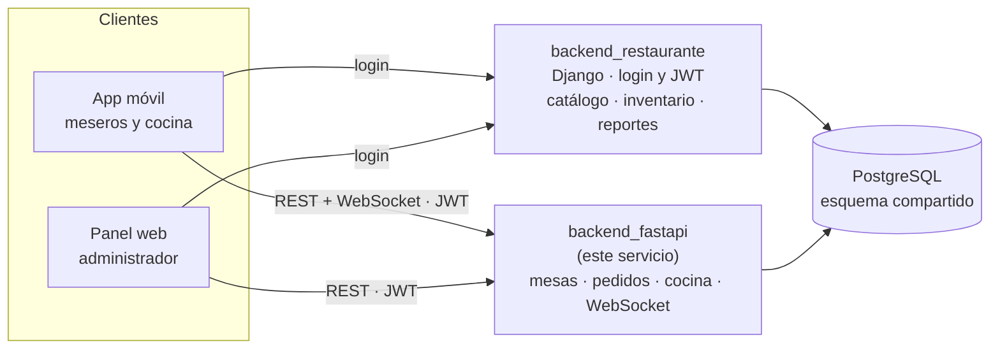
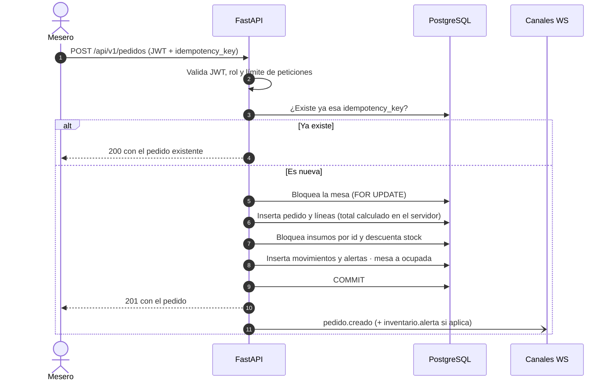
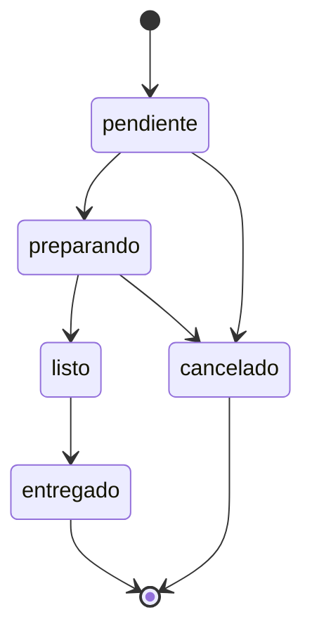

# Restaurante · API operativa

**Backend de alta frecuencia para la operación de un restaurante: mesas, pedidos, tablero de cocina, cobro de cuentas y eventos en tiempo real.**

[](https://www.python.org/)
[](https://fastapi.tiangolo.com/)
[](https://www.sqlalchemy.org/)
[](https://www.postgresql.org/)
[](#pruebas)

Este servicio (`backend_fastapi`) es la parte operativa del **Sistema Web de Gestión para Restaurantes**. Convive con un backend administrativo en Django y comparte con él la base de datos PostgreSQL y el JWT de autenticación.

## Contenido

- [El problema que resuelve](#el-problema-que-resuelve)
- [Características](#características)
- [Tecnologías](#tecnologías)
- [Arquitectura](#arquitectura)
- [Requisitos previos](#requisitos-previos)
- [Instalación y configuración](#instalación-y-configuración)
- [Variables de entorno](#variables-de-entorno)
- [Ejecución](#ejecución)
- [Estructura del proyecto](#estructura-del-proyecto)
- [API](#api)
- [Flujo de funcionamiento](#flujo-de-funcionamiento)
- [Autenticación y autorización](#autenticación-y-autorización)
- [Tiempo real (WebSocket)](#tiempo-real-websocket)
- [Pruebas](#pruebas)
- [Decisiones de diseño](#decisiones-de-diseño)
- [Limitaciones conocidas](#limitaciones-conocidas)
- [Contexto del sistema](#contexto-del-sistema)

## El problema que resuelve

En un restaurante varios meseros toman pedidos a la vez sobre las mismas mesas y el mismo inventario, la cocina necesita ver cada pedido al instante y la cuenta de una mesa se cobra muchas veces en pagos parciales. Un doble toque en la app o un reintento de red no puede duplicar un pedido ni descontar el stock dos veces.

Este servicio resuelve esa operación en línea:

- Cada pedido se registra, descuenta insumos y ocupa la mesa en **una sola transacción**: o se aplica todo o no se aplica nada.
- Es **idempotente**: reenviar la misma petición devuelve el mismo pedido.
- Notifica por **WebSocket** a cocina y salón sin que tengan que recargar.

Vive separado del backend administrativo porque es la parte que necesita baja latencia.

## Características

| Área | Qué hace |
|---|---|
| **Pedidos** | Creación transaccional: inserta pedido y líneas, calcula el total en el servidor (nunca confía en el precio del cliente), descuenta insumos según la receta, registra movimientos de inventario y ocupa la mesa. |
| **Idempotencia** | Cada pedido lleva una `idempotency_key` (UUID) con índice único. Las peticiones simultáneas con la misma clave devuelven siempre el mismo pedido. |
| **Concurrencia** | Bloqueo de filas con `SELECT … FOR UPDATE` sobre la mesa y sobre los insumos, estos últimos siempre en orden ascendente de `id`. |
| **Inventario** | Descuenta stock por venta, repone al cancelar, responde `409` si falta stock y levanta una alerta cuando el insumo queda en su mínimo o por debajo. |
| **Estados** | Máquina de estados del pedido con transiciones validadas, más estado por línea que puede promover el estado del pedido. |
| **Cocina** | Tablero por columnas (`pendiente`, `preparando`, `listo`) y métricas (conteos, ítems pendientes, espera promedio). |
| **Cuenta de mesa** | Pagos parciales o divididos por método (`efectivo`, `yape`, `plin`, `tarjeta`, `mercado_pago`), saldo pendiente y liberación de la mesa; un administrador puede forzar el cierre con saldo. |
| **Tiempo real** | Canales WebSocket `cocina` y `salon` con eventos de pedidos, mesas, pagos y alertas de stock. |
| **Seguridad** | Verificación del JWT emitido por Django y autorización por rol (`mesero`, `cocina`, `inventario`, `admin`). Límite de peticiones por usuario al crear pedidos. |
| **Observabilidad** | Logs en JSON con identificador de petición (`X-Request-ID`), endpoint `/health` que comprueba la base de datos y errores con formato uniforme (`detail` + `code`). |

## Tecnologías

| Componente | Tecnología | Versión | Uso |
|---|---|---|---|
| Lenguaje | Python | 3.10+ (imagen Docker: 3.12) | — |
| Framework web | FastAPI | 0.115.8 | API REST, WebSocket y documentación OpenAPI |
| Servidor ASGI | Uvicorn (`standard`) | 0.34.0 | Ejecución de la aplicación |
| ORM | SQLAlchemy (`asyncio`) | 2.0.37 | Acceso asíncrono a PostgreSQL |
| Driver | asyncpg | 0.30.0 | Conexión asíncrona a PostgreSQL |
| Validación | Pydantic / pydantic-settings | 2.10.6 / 2.7.1 | Esquemas de entrada/salida y configuración por entorno |
| Autenticación | PyJWT | 2.10.1 | Verificación del token de acceso |
| Logging | python-json-logger | 3.2.1 | Logs estructurados |
| Pruebas | pytest, pytest-asyncio, httpx | 8.3.4 / 0.25.3 / 0.28.1 | Pruebas de integración contra la API |
| Base de datos | PostgreSQL | 15+ (Compose: 16) | Persistencia, bloqueos de fila, enums nativos |
| Contenedores | Docker | — | Imagen basada en `python:3.12-slim` |

## Arquitectura

El sistema completo está formado por dos backends que comparten base de datos y clientes que consumen ambos:



Dentro de este servicio el código se organiza en capas:

```
api/v1 (routers)  →  services (reglas y transacciones)  →  models (SQLAlchemy)  →  PostgreSQL
      │                                                          ▲
      └── deps (JWT + rol)      schemas (Pydantic)      core (config, BD, WebSocket, límites)
```

### Reparto de responsabilidades con el backend Django

| Tablas | Quién escribe |
|---|---|
| `mesas`, `pedidos`, `detalle_pedido`, `pagos` | Solo este servicio |
| Catálogo, proveedores, usuarios | Solo Django |
| `insumos`, `movimientos_inventario`, `alertas_inventario` | Ambos, siempre en transacciones con bloqueo de fila y el mismo orden de bloqueo |

Este servicio **no crea ni migra tablas**: mapea con SQLAlchemy un esquema que ya existe (los enums de PostgreSQL se declaran con `create_type=False`). El esquema se define en `schema.sql`, en la raíz del sistema, y lo aplica la migración inicial de Django.

## Requisitos previos

- **Python 3.10 o superior** y `pip`.
- **PostgreSQL 15+** con el esquema del sistema ya aplicado (ver [Instalación](#instalación-y-configuración)).
- El **`JWT_SECRET` del backend Django**: este servicio no tiene login, solo verifica los tokens que Django emite con ese mismo secreto.
- *(Opcional)* Docker y Docker Compose, para levantar todo el sistema.

## Instalación y configuración

Los comandos se ejecutan desde la carpeta `backend_fastapi`. Importante: el archivo `.env` se busca en el directorio desde el que se lanza el servicio.

### 1. Base de datos

Crea la base y deja que Django aplique el esquema (la migración inicial ejecuta `schema.sql` si la tabla `usuarios` aún no existe). Como el login también lo resuelve Django, se recomienda cargar además los datos de demostración:

```bash
psql -U postgres -c "CREATE DATABASE restaurante ENCODING 'UTF8';"

cd ../backend_restaurante          # en su propio entorno virtual, con su .env
pip install -r requirements.txt
python manage.py migrate
python manage.py seed_demo         # mesas, productos con receta, insumos y cuentas de demostración
```

Las cuentas de demostración que crea `seed_demo` están documentadas en el README de la raíz del sistema.

### 2. Entorno de este servicio

**Windows (PowerShell)**

```powershell
python -m venv .venv
.\.venv\Scripts\Activate.ps1
pip install -r requirements.txt
Copy-Item .env.example .env
```

**Linux / macOS**

```bash
python -m venv .venv
source .venv/bin/activate
pip install -r requirements.txt
cp .env.example .env
```

Edita `.env` y ajusta al menos las credenciales de base de datos y `JWT_SECRET` (debe ser **idéntico** al de Django). Ver [Variables de entorno](#variables-de-entorno).

## Variables de entorno

La configuración se carga con `pydantic-settings` desde `.env` y desde las variables del entorno. Las variables de entorno tienen prioridad sobre el archivo.

| Variable | Por defecto | Descripción |
|---|---|---|
| `APP_NAME` | `backend_fastapi` | Nombre que devuelve `/health`. |
| `DEBUG` | `False` | `True`: logs legibles y nivel `DEBUG`. `False`: logs JSON, nivel `INFO`. |
| `DB_NAME` | `restaurante` | Nombre de la base de datos. |
| `DB_USER` | `postgres` | Usuario de PostgreSQL. |
| `DB_PASSWORD` | valor de desarrollo incluido en el código (ver nota) | Contraseña de PostgreSQL. |
| `DB_HOST` | `localhost` | Host de PostgreSQL. |
| `DB_PORT` | `5432` | Puerto de PostgreSQL. |
| `DB_ECHO` | `False` | Registra el SQL generado por SQLAlchemy. |
| `DB_POOL_SIZE` | `10` | Tamaño del pool de conexiones. |
| `DB_MAX_OVERFLOW` | `20` | Conexiones extra permitidas sobre el pool. |
| `JWT_SECRET` | valor de desarrollo incluido en el código (ver nota) | Secreto para verificar el JWT. **Debe coincidir con el de Django.** |
| `JWT_ALGORITHM` | `HS256` | Algoritmo de firma del JWT. |
| `CORS_ORIGINS` | `http://localhost:5174,http://127.0.0.1:5174` | Orígenes permitidos, separados por comas. |
| `RATE_LIMIT_PEDIDOS` | `30` | Peticiones de creación de pedido permitidas por usuario y ventana. |
| `RATE_LIMIT_VENTANA_SEGUNDOS` | `60` | Duración de la ventana del límite, en segundos. |

Ejemplo de `.env` (sustituye los valores entre `<>`):

```dotenv
APP_NAME=backend_fastapi
DEBUG=True

DB_NAME=restaurante
DB_USER=postgres
DB_PASSWORD=<contraseña-de-postgres>
DB_HOST=localhost
DB_PORT=5432

JWT_SECRET=<mismo-secreto-que-backend_restaurante>
JWT_ALGORITHM=HS256

CORS_ORIGINS=http://localhost:5174,http://127.0.0.1:5174

RATE_LIMIT_PEDIDOS=30
RATE_LIMIT_VENTANA_SEGUNDOS=60
```

> **Nota de seguridad:** si `JWT_SECRET` o `DB_PASSWORD` no se definen, el servicio arranca con un valor por defecto que figura en el código fuente y, por tanto, es público. Defínelos siempre, y no versiones el archivo `.env`.

## Ejecución

### Desarrollo local

```bash
uvicorn app.main:app --reload --port 8011
```

Al arrancar, el servicio verifica la conexión a PostgreSQL y falla si no puede conectarse.

| Recurso | URL |
|---|---|
| Documentación interactiva (Swagger UI) | <http://localhost:8011/docs> |
| Documentación alternativa (ReDoc) | <http://localhost:8011/redoc> |
| Esquema OpenAPI | <http://localhost:8011/openapi.json> |
| Comprobación de salud | <http://localhost:8011/health> |

```bash
curl http://localhost:8011/health
# {"status":"ok","service":"backend_fastapi"}
```

### Probar la API con un token

El servicio no emite tokens: inicia sesión en Django y usa el `access` que devuelve.

```bash
# 1. Login en Django (puerto 8010) con una cuenta del sistema
curl -X POST http://localhost:8010/api/auth/login/ \
  -H "Content-Type: application/json" \
  -d '{"email": "<correo>", "password": "<contraseña>"}'

# 2. Crear un pedido con el token (los ids son ilustrativos)
curl -X POST http://localhost:8011/api/v1/pedidos \
  -H "Authorization: Bearer <access>" \
  -H "Content-Type: application/json" \
  -d '{
        "mesa_id": 1,
        "idempotency_key": "3f0c6b0e-5d0f-4c1e-9a53-2a6f5d2f0a11",
        "lineas": [{"producto_id": 1, "cantidad": 2, "notas": "sin cebolla"}]
      }'
```

Repite el segundo comando con la misma `idempotency_key`: responde `200` con el mismo pedido, sin duplicarlo ni volver a descontar stock. En Swagger UI, el botón **Authorize** acepta el mismo `access`.

### Docker

**Sistema completo**, desde la raíz del sistema (donde está `docker-compose.yml`):

```bash
docker compose up --build
```

Levanta PostgreSQL 16, el backend Django (aplica migraciones y `seed_demo`), este servicio en el puerto **8011** y el panel web en el **5174**. Define `JWT_SECRET` y `DB_PASSWORD` en el entorno o en un `.env` junto al compose; los valores por defecto del compose son solo para desarrollo.

**Solo este servicio:**

```bash
docker build -t restaurante-api-operativa .
docker run --rm -p 8011:8011 --env-file .env restaurante-api-operativa
```

`DB_HOST` debe ser alcanzable desde el contenedor (`localhost` dentro del contenedor no apunta a tu máquina). La imagen arranca `uvicorn` con `--workers 2`.

## Estructura del proyecto

```
backend_fastapi/
├── app/
│   ├── main.py                    # App FastAPI, CORS, X-Request-ID, manejadores de error y /health
│   ├── api/
│   │   ├── deps.py                # Sesión de BD, usuario actual y dependencias por rol
│   │   └── v1/
│   │       ├── mesas.py           # Mesas, cuenta, pagos y liberación
│   │       ├── pedidos.py         # Pedidos, estados, líneas y pagos por pedido
│   │       ├── cocina.py          # Tablero y métricas de cocina
│   │       └── websocket.py       # Canales en tiempo real
│   ├── core/
│   │   ├── config.py              # Configuración (pydantic-settings)
│   │   ├── database.py            # Motor asíncrono, sesión y Base declarativa
│   │   ├── security.py            # Verificación del JWT y usuario autenticado
│   │   ├── websocket_manager.py   # Conexiones por canal y difusión de eventos
│   │   ├── rate_limit.py          # Ventana deslizante en memoria
│   │   └── logging.py             # Logs JSON con identificador de petición
│   ├── models/                    # Modelos SQLAlchemy del esquema existente y enums
│   ├── schemas/                   # Esquemas Pydantic y eventos WebSocket
│   ├── services/
│   │   ├── pedido_service.py      # Creación de pedidos y máquina de estados
│   │   ├── pago_service.py        # Cuenta de mesa, pagos y liberación
│   │   ├── inventario_client.py   # Consumo por receta, descuento/reposición de stock y alertas
│   │   └── idempotency.py         # Búsqueda de pedido por clave de idempotencia
│   └── tests/                     # 39 pruebas de integración (pytest + httpx)
├── Dockerfile
├── pytest.ini
├── requirements.txt
└── .env.example
```

## API

Todas las rutas de negocio cuelgan de `/api/v1` y exigen `Authorization: Bearer <access>`, salvo `/health`. El rol `admin` tiene acceso a todo. La referencia completa e interactiva está en `/docs`.

### Endpoints

| Método | Ruta | Rol requerido | Descripción |
|---|---|---|---|
| `GET` | `/health` | público | Estado del servicio y de la base de datos |
| `GET` | `/api/v1/mesas` | cualquiera autenticado | Lista mesas con pedidos activos y total en curso (filtro `estado`) |
| `POST` | `/api/v1/mesas` | inventario | Crea una mesa |
| `GET` | `/api/v1/mesas/{id}` | cualquiera autenticado | Detalle de una mesa |
| `PATCH` | `/api/v1/mesas/{id}` | cualquiera autenticado | Cambia capacidad o estado |
| `DELETE` | `/api/v1/mesas/{id}` | inventario | Elimina una mesa sin pedidos históricos |
| `GET` | `/api/v1/mesas/{id}/cuenta` | cualquiera autenticado | Total, pagado y saldo de la mesa |
| `POST` | `/api/v1/mesas/{id}/pagos` | mesero, cocina | Registra un pago parcial o total |
| `POST` | `/api/v1/mesas/{id}/liberar` | mesero, cocina | Libera la mesa (`forzar`: solo admin). Requiere cuerpo JSON, aunque sea `{}` |
| `GET` | `/api/v1/pedidos` | cualquiera autenticado | Lista pedidos (filtros `estado`, `mesa_id`, `solo_mios`, `limite` 1–200) |
| `POST` | `/api/v1/pedidos` | mesero, cocina | Crea un pedido (`201`) o devuelve el existente (`200`) |
| `GET` | `/api/v1/pedidos/{id}` | cualquiera autenticado | Detalle de un pedido |
| `PATCH` | `/api/v1/pedidos/{id}/estado` | mesero, cocina | Cambia el estado del pedido |
| `PATCH` | `/api/v1/pedidos/{id}/lineas/{linea}` | mesero, cocina | Cambia el estado de una línea |
| `POST` | `/api/v1/pedidos/{id}/pagos` | mesero, cocina | Registra un pago contra un pedido concreto |
| `GET` | `/api/v1/cocina/tablero` | cualquiera autenticado | Pedidos abiertos agrupados por estado (`limite` 1–200) |
| `GET` | `/api/v1/cocina/metricas` | cualquiera autenticado | Conteos por estado, ítems pendientes y espera promedio |
| `POST` | `/api/v1/cocina/pedidos/{id}/preparar` | cocina | Pasa el pedido a `preparando` |
| `POST` | `/api/v1/cocina/pedidos/{id}/listo` | cocina | Pasa el pedido a `listo` |
| `WS` | `/api/v1/ws/{canal}?token=…` | cualquier token válido | Canales `cocina` y `salon` |

### Formato de errores

Los errores de reglas de negocio devuelven un JSON con `detail` y un `code` estable:

| HTTP | `code` | Cuándo |
|---|---|---|
| `400` | `transicion_invalida` | El cambio de estado no está permitido por la máquina de estados |
| `400` | `producto_inactivo` | El pedido incluye productos no disponibles |
| `400` | `pago_excedido` | El pago supera el saldo pendiente |
| `400` | `sin_pedidos` | Se intenta cobrar una mesa sin pedidos |
| `400` | `conflicto_concurrencia` | No se pudo resolver un conflicto de idempotencia |
| `404` | `no_encontrado` | Mesa, pedido, línea o producto inexistente |
| `409` | `stock_insuficiente` | Falta un insumo; incluye además `insumo`, `disponible` y `requerido` |

Otras respuestas: `401` (token ausente, inválido o expirado), `403` (rol sin acceso), `422` (validación del cuerpo) y `429` (límite de peticiones, con cabecera `Retry-After`).

## Flujo de funcionamiento

Ciclo de vida de una mesa:

1. El **mesero** crea el pedido → la mesa pasa a `ocupada` y cocina lo ve en su tablero.
2. **Cocina** lo pasa a `preparando` y luego a `listo`.
3. El **mesero** lo marca como `entregado`. La mesa **sigue ocupada**: `entregado` significa comida servida, no mesa vacía.
4. Se **cobra** la cuenta de la mesa con uno o varios pagos parciales.
5. Se **libera** la mesa, lo que exige saldo 0 salvo que un administrador fuerce el cierre.

La mesa solo vuelve a `libre` por sí sola cuando se cancelan todos sus pedidos.

### Creación de un pedido



`app/services/pedido_service.py::crear_pedido` ejecuta todo en una única transacción:

1. Busca la `idempotency_key`; si existe, devuelve el pedido existente con **200** en lugar de crear otro y responder 201.
2. Bloquea la mesa (`SELECT … FOR UPDATE`).
3. Carga los productos y rechaza los inexistentes (`404`) o inactivos (`400`).
4. Inserta `pedidos` y `detalle_pedido`, calculando el total en el servidor.
5. Agrega el consumo de todas las recetas por insumo, bloquea esos insumos **ordenados por id** y descuenta el stock. Si falta stock, aborta con **409**.
6. Inserta un `movimientos_inventario` de salida por insumo y crea una `alertas_inventario` si el stock quedó en el mínimo o por debajo (y no hay ya una alerta sin atender para ese insumo).
7. Marca la mesa como ocupada y confirma.

Si cualquier paso falla, el rollback deja stock, mesa y pedido como estaban. Cancelar un pedido repone los insumos con movimientos de entrada.

**Idempotencia.** La clave viola un índice único, y esa violación puede saltar tanto en el `flush` como en el `commit`, según cuándo confirme la transacción rival. Ambos casos se capturan y se resuelven releyendo el pedido ganador, así que dos peticiones simultáneas con la misma clave devuelven siempre el mismo pedido.

**Orden de bloqueo.** Al crear un pedido y al cancelarlo, la mesa se bloquea antes que los insumos, y estos siempre por id ascendente. Un único orden evita interbloqueos entre dos meseros que venden el mismo insumo a la vez.

### Estados del pedido



Las transiciones fuera de este grafo devuelven `400` con `transicion_invalida`. Las líneas del pedido tienen sus propios estados: cuando una línea pasa a `preparando` el pedido pendiente pasa a `preparando`, y cuando todas las líneas activas están `listo` el pedido en preparación pasa a `listo`.

### Cuenta y cobro de la mesa

- `POST /mesas/{id}/pagos` reparte el monto entre los pedidos con saldo, del más antiguo al más reciente, e inserta un `Pago` confirmado por cada parte. Rechaza montos superiores al saldo de la mesa.
- `POST /mesas/{id}/liberar` exige saldo 0. Un administrador puede enviar `forzar: true` (y un `motivo`): el saldo restante se registra como un pago de cierre forzado (`referencia_externa` = `cierre_forzado[:motivo]`).

## Autenticación y autorización

Este servicio **no tiene login**. Verifica el JWT que emite Django, firmado con el mismo secreto y algoritmo, y **no consulta la tabla de usuarios en cada petición**. El token debe cumplir:

- Firma válida y no expirada.
- `token_type` igual a `access`.
- `user_id` con un UUID válido.
- `rol` dentro de `mesero`, `cocina`, `inventario` o `admin`. `nombre` y `email` son opcionales.

`app/api/deps.py` expone las dependencias de rol `UsuarioMesero`, `UsuarioCocina`, `UsuarioSalon` (mesero o cocina) y `UsuarioGestion` (inventario). El rol `admin` pasa siempre.

> Si los `JWT_SECRET` de ambos servicios no coinciden, el login en Django funciona pero este servicio responde `401` a todo.

## Tiempo real (WebSocket)

`app/core/websocket_manager.py` mantiene los canales `cocina` y `salon`. La conexión se abre en `/api/v1/ws/{canal}?token=<access>`; el token viaja por query string porque el navegador no permite cabeceras propias al abrir un WebSocket. Un canal desconocido o un token inválido rechazan la conexión (`1008 Policy Violation`).

Cada mensaje tiene la forma `{ "tipo": "...", "datos": { ... }, "emitido_en": "<fecha ISO 8601>" }`.

| Evento | Canales | Datos principales |
|---|---|---|
| `conexion.establecida` | solo el cliente que se conecta | `canal`, `usuario`, `rol` |
| `pedido.creado` | `cocina`, `salon` | `pedido` |
| `pedido.estado` | `cocina`, `salon` | `pedido_id`, `estado`, `mesa_numero`, `pedido` |
| `pedido.linea.estado` | `cocina`, `salon` | `pedido_id`, `linea_id`, `estado`, `pedido` |
| `mesa.estado` | `cocina`, `salon` | `mesa_id`, `numero`, `estado` |
| `pago.registrado` | `cocina`, `salon` | `mesa_id`, `numero`, `pagado`, `saldo` |
| `inventario.alerta` | `salon` | `insumo_id`, `mensaje` |

Si el cliente envía el texto `ping`, el servidor responde `pong`.

```js
const ws = new WebSocket(`ws://localhost:8011/api/v1/ws/cocina?token=${access}`);
ws.onmessage = (e) => {
  const { tipo, datos } = JSON.parse(e.data);
  console.log(tipo, datos);
};
```

## Pruebas

```bash
pytest
```

El proyecto incluye **39 pruebas** de integración (`pytest.ini` apunta a `app/tests` y activa `asyncio_mode = auto`):

| Archivo | Pruebas | Cubre |
|---|---|---|
| `test_pedidos.py` | 12 | Total calculado en servidor, descuento por receta, movimientos de inventario, mesa ocupada, `409` por stock insuficiente con rollback, productos inactivos, validaciones y control de acceso por rol |
| `test_idempotency.py` | 5 | Reenvío de la misma clave, sin doble descuento de stock, claves distintas, doble clic simultáneo y clave mal formada |
| `test_cocina.py` | 10 | Tablero, flujo completo de estados, transiciones inválidas, estado terminal, reposición al cancelar, liberación de mesa y promoción por líneas |
| `test_pagos.py` | 12 | Cuenta de mesa, pagos parciales y con distintos métodos, pago excedido, liberación con y sin saldo, cierre forzado por admin y saldo en el listado de mesas |

**Requisitos para ejecutarlas:** PostgreSQL con el esquema aplicado y un `.env` configurado. No hace falta que Django esté en ejecución: las pruebas firman sus propios tokens con `JWT_SECRET`.

> Las pruebas corren contra la base de datos real configurada en `.env` (no hay una base de pruebas aparte). Crean sus propios datos con prefijo `pytest_` y los eliminan al terminar, pero no las apuntes a una base con datos que no quieras exponer.

## Decisiones de diseño

- **Servicio aparte del backend administrativo.** La operación en sala es la parte sensible a la latencia; el catálogo, los reportes y los usuarios viven en Django.
- **Autenticación delegada.** Un solo login sirve para ambos backends y para el WebSocket; este servicio solo verifica el token.
- **El esquema tiene un único dueño.** `schema.sql` es la fuente de verdad, aplicada por Django. Ni este servicio ni Django pueden alterarlo por su cuenta.
- **El servidor decide los importes.** Los precios se leen de la base de datos y los montos se manejan con `Decimal` / `NUMERIC`.
- **Consistencia antes que velocidad en el stock.** Bloqueo pesimista de filas con orden de bloqueo fijo, en lugar de reintentos optimistas.
- **Idempotencia respaldada por la base de datos.** El índice único es el árbitro final, no una comprobación en memoria.

## Limitaciones conocidas

- **Estado en memoria por proceso.** El gestor de WebSocket y el limitador de peticiones guardan su estado en la memoria del proceso. Con varios workers (la imagen Docker usa `--workers 2`) o varias instancias, un evento solo llega a los clientes conectados al mismo proceso y el límite se cuenta por proceso. Escalar horizontalmente requeriría un canal compartido entre procesos (por ejemplo, Redis pub/sub).
- **Sin autorización por canal.** Cualquier token válido puede suscribirse a `cocina` o `salon`, sin importar su rol.
- **Sin migraciones propias.** Depende de que el esquema ya exista; no puede inicializar una base vacía por sí solo.
- **Pruebas contra la base real.** No hay una base de pruebas aislada (ver [Pruebas](#pruebas)).

## Contexto del sistema

Este servicio forma parte de un sistema más amplio; el resto de componentes se documentan en el README de la raíz:

| Componente | Stack | Puerto | Responsabilidad |
|---|---|---|---|
| `backend_restaurante` | Django 5 + DRF | 8010 | Usuarios y roles, catálogo, recetas, inventario, proveedores, compras, reportes |
| `backend_fastapi` | FastAPI + SQLAlchemy async | 8011 | **Este servicio** |
| `frontend_restaurante` | React 19 + TypeScript + Vite | 5174 | Panel del administrador |
| `frontend_movil_restaurante` | Flutter (Dart ^3.5.2) | — | App de meseros y cocina |

